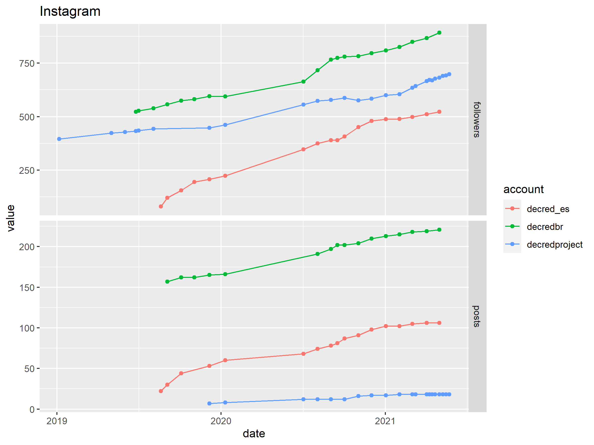
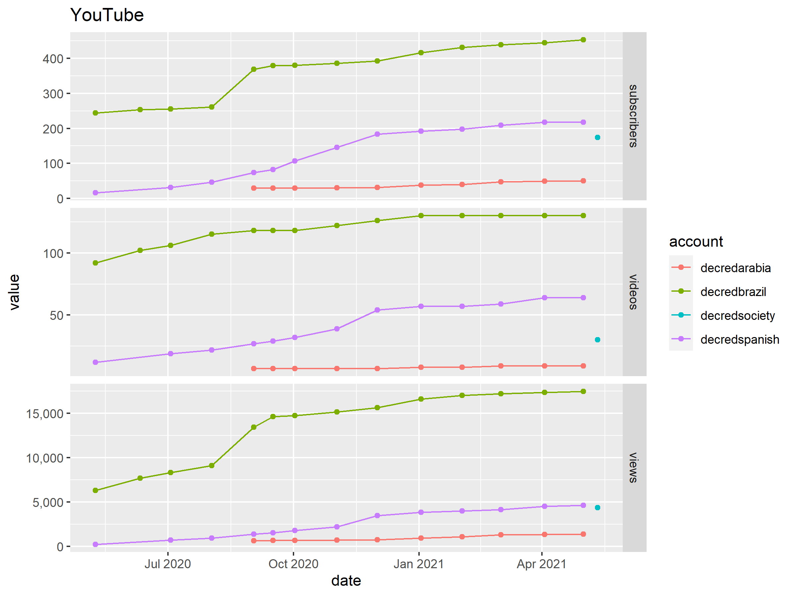
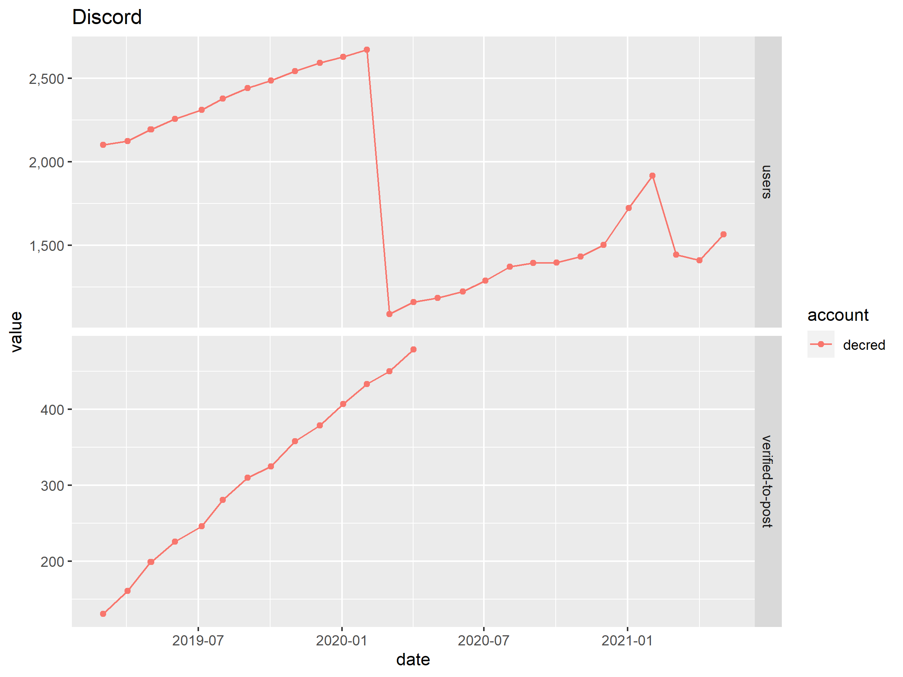

# Graphs of available social media data

The graphs below use data from 2020-08-03 (master commit [c2ca504](https://github.com/xaur/social-media-data/commit/c2ca5041734a843ba1618556626e74c2eb451382)).

